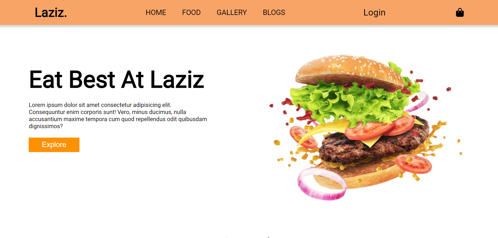

# Laziz Food Website

Welcome to the Laziz Food website project! This repository contains the source code for the Laziz Food website, a vibrant and user-friendly platform designed to enhance the digital presence of Laziz Food.

## Technologies Used

- **HTML**: For the structure and content of the website.
- **CSS**: For styling and layout, ensuring a visually appealing and responsive design.
- **JavaScript**: For dynamic content and interactive features.

## Features

- 📱 **Responsive Design**: The website is fully responsive, providing an optimal viewing experience across a wide range of devices, from desktop computers to mobile phones.
- 🎨 **Modern UI/UX**: Focused on intuitive navigation and appealing aesthetics, the site offers an engaging user experience.
- ⚡ **Dynamic Content**: Incorporates JavaScript for interactive features such as a dynamic menu and real-time updates.
- 🚀 **Optimized Performance**: Ensures fast load times and smooth browsing by implementing best practices in coding and design.

## Getting Started

To get a local copy of the Laziz Food website up and running, follow these simple steps.

### Prerequisites

Make sure you have the following installed on your local machine:

- [Git](https://git-scm.com/)
- A modern web browser

### Installation

1. **Clone the repository:**
   ```sh
   git clone https://github.com/your-username/laziz-food-website.git
2. **Navigate to the Project directory:**'
    cd laziz-food-website
3. **Open the index.html file in your web browser:**
    open index.html

### Usage
Explore the website to see the various features and content sections. The dynamic menu and other interactive elements showcase the power of JavaScript in enhancing user engagement.

### Contributing
Contributions are welcome! If you have suggestions for improvements or new features, please feel free to submit a pull request or open an issue.

### Contact
For any questions or inquiries, please reach out:

<div align="left">
   
   <h4 align="left">Risham Goyal (https://github.com/itsrisham)</h4>
   <h4 align="left">Linkedin Profile(www.linkedin.com/in/risham-goyal-755798267)</h4>
</div>

_________________________________________________________________________


Thank you for visiting the Laziz Food website repository! Enjoy exploring and feel free to get in touch if you'd like to collaborate on future projects.
